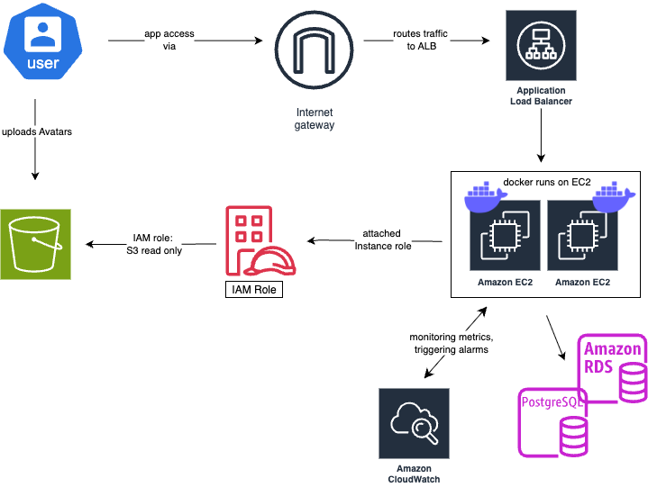

# Grocery App – AWS Cloud Deployment 🚀

This project was built as part of the role-based learning phase in my **Software Engineering Bootcamp** at Masterschool, with a **focus on Cloud Engineering**.

It demonstrates the deployment of a containerized grocery web app using key AWS services like EC2, ALB, ASG, RDS, and S3 – applying Infrastructure as Code with **Terraform**.

> Built with patience, persistence and a few moments of AWS-induced despair.

---

## 🧾 TL;DR

Full-stack grocery app deployed on AWS via Terraform.
Key services: EC2 (Docker), ALB, ASG, RDS (PostgreSQL), S3 (uploads), CloudWatch (logs & alarms).
---

## 📚 Table of Contents

- [TL;DR](#-tldr)
- [What This Is (and What It Isn’t)](#-what-this-is-and-what-it-isnt)
- [Architecture Overview](#-architecture-overview)
- [Architecture Diagram](./assets/aws-architecture-diagram.png)
- [Security Groups – Who Talks to Whom](#-security-groups--who-talks-to-whom)
- [Deployment Steps](#-deployment-steps-simplified)
- [Why Terraform?](#-why-terraform)
- [Things I Learned](#-things-i-learned)
- [Final Thoughts](#-final-thoughts)
- [Up Next](#-up-next)
- [About Me (Real Talk)](#-about-me-real-talk)

---

## 🧠 What This Is (and What It Isn’t)

This is **not** a tutorial on how to build a grocery app.  
This is **not** about frontend or backend magic.

This **is** a real-world deployment scenario showing how I set up cloud infrastructure from scratch and got it to work, eventually:

- **EC2** – runs the Docker container  
- **Application Load Balancer (ALB)** – routes traffic and checks instance health  
- **Auto Scaling Group (ASG)** – launches new EC2s  
  The infamous [Taylor Swift ticket sale crash](https://fortune.com/2023/07/11/ticketmaster-france-crashes-taylor-swift-eras-tour-1-million-queue/?utm_source=chatgpt.com) is a perfect real-life example of how infrastructure issues can scale out of control – and how such incidents help turn abstract AWS theory into something tangible.  
  *SideNote:* I only know about this because I have a teenager at home who's a Swiftie.  
- **Amazon RDS (PostgreSQL)** – managed relational database  
- **Amazon S3** – stores user-uploaded avatars  
- **IAM** – EC2 can upload to S3 via attached IAM Role  
- **CloudWatch** – EC2 health monitoring.  
  *When your EC2 decides to ghost you* 👻 _(when it goes down or becomes unreachable)_

Original app by [Alejandro Roman Ibanez](https://github.com/AlejandroRomanIbanez), one of my mentors and tutors during this journey.  
Thank you, Alejandro, for your patience, clarity, and the repo that made this deployment possible. 🙏  
The app itself wasn’t modified, just everything around it.

Original repo: [AWS Grocery App by Alejandro](https://github.com/AlejandroRomanIbanez/AWS_grocery)

---

## ☁ Architecture Overview

- **EC2** (in Public Subnet): Hosts the containerized app. Accessible via SSH (restricted by SG).
- **Application Load Balancer**: Public-facing, listens on Port 80. Forwards to Target Group (EC2s) on Port 5000.
- **Target Group (TG)**: Monitors health checks (Port 5000). Only routes to healthy instances.
- **Auto Scaling Group (ASG)**: Launches new EC2s when needed. Uses Launch Template and listens to ALB health.
- **Amazon RDS (PostgreSQL)**: In Private Subnet. Accessible only from EC2 via SG.
- **Amazon S3**: Stores user avatars. EC2 has IAM Role with limited read/write access.
- **IAM Role + Policy**: Manually created and attached to EC2 to allow only necessary S3 actions
- **CloudWatch**: Manually configured to send alerts, if EC2 goes down or becomes unreachable

All services live inside a **single VPC**, with **public/private subnets** distributed across **two Availability Zones**.

---

## 🗺️ Architecture Diagram

---

## 🔐 Security Groups – Who Talks to Whom

- **ALB SG**  
  - Inbound: HTTP (80) from `0.0.0.0/0`  
  - Outbound: HTTP (5000) to EC2 SG

- **EC2 SG**  
  - Inbound:  
    - HTTP (5000) from ALB SG  
    - SSH (22) from my IP  
  - Outbound: PostgreSQL (5432) to RDS SG

- **RDS SG**  
  - Inbound: PostgreSQL (5432) from EC2 SG  
  - Outbound: All traffic (default)

---

## 🪜 Deployment Steps (Simplified)

1. Defined VPC, subnets, route tables, and internet gateway (IGW)
2. Set up EC2 instance with Docker and ran the app container
3. Attached ALB and linked it to Target Group with health checks
4. Created ASG to ensure availability under load
5. Provisioned PostgreSQL RDS (private subnet)
6. Configured IAM Role for EC2 to allow avatar uploads to S3
7. Created S3 bucket
8. Set up CloudWatch alarm for EC2
9. Implemented Infrastructure as Code using Terraform

---

## 🧰 Why Terraform?

Because clicking through the AWS Console is fun exactly once.

We used **Terraform** to define and deploy nearly everything except for the IAM Role and CloudWatch alarm, which were created manually (for now).

Terraform allows:

- **Repeatability** – same setup every time  
- **Automation** – define once, deploy many  
- **Versioning** – track changes just like code  
- **Reusable across clouds** – not just AWS-specific

---

## 😅 Things I Learned

- You need more subnets than you think.
- ALB won’t forward anything if your TG isn’t healthy.
- Security Groups are like bouncers: get them wrong, and nobody gets in.
- IAM roles should be as minimal as possible and they will still feel too complicated.
- Terraform is awesome once you get it. Before that, it’s more like TERRORform.
- AWS logs you out just when you’re finally ready to test.  
  But maybe it knows your limits better than you…

---

## ✅ Final Thoughts

This wasn’t about building a new app from scratch.  
It was about making existing software production-ready in the cloud.  
It taught me how the pieces of cloud infrastructure fit together, how to troubleshoot under pressure, and how to think like a cloud engineer, not just a developer.

If this infrastructure were a partner, you'd just have to say:  
**"Clean the kitchen."**  and without saying more, the dishes would be done, the trash taken out, the counters wiped, and the floor mopped.  
Everything running smoothly in the background – just like good infrastructure should.

> It’s not magic. It’s just cloud. And a lot of trial and error.

---

## 🔜 Up Next

Here’s what’s still planned for this project:

- [ ] Migrate IAM Role & Policy creation to Terraform  
- [ ] Automate CloudWatch alarm setup via Terraform

---

## 👋 About Me (Real Talk)

I'm a career switcher with **12+ years of entrepreneurial experience in the hospitality industry**,  
currently transitioning into tech through a **Cloud Engineering track** while also pursuing certification in **systemic-integrative coaching**, to deepen my interpersonal and communication skills.

This project reflects not just what I learned technically but also how I learn:  
hands-on, iterative, resilient, and with a sense of humor that keeps me going.

I'm not a finished product. But I show up, I learn fast or at least try to 😅, and I build.